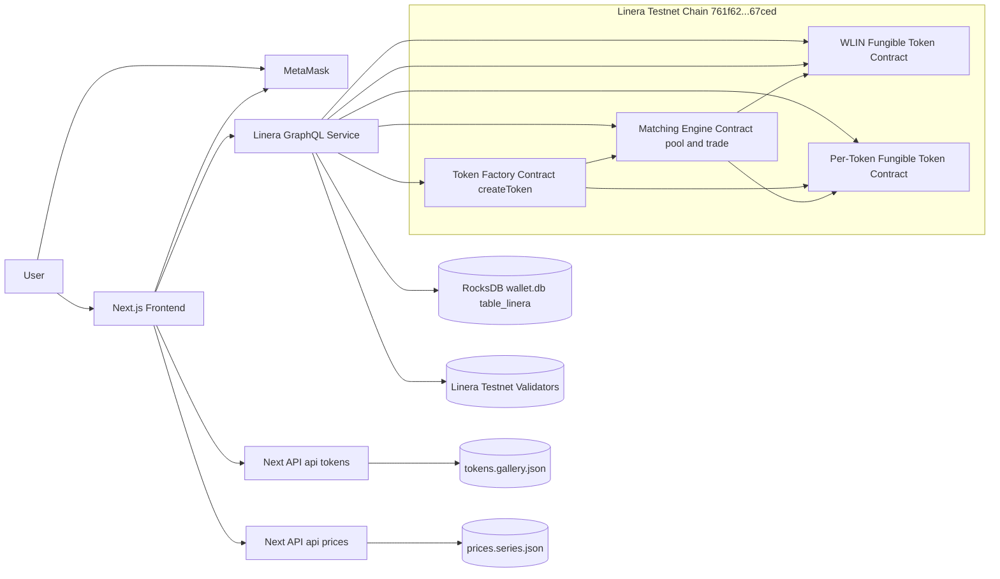

Linera-Intents Wave6
=====================

## Why Linera ?

We chose Linera because it supports multiple account key types (Ed25519 for Linera-native ownership/proposing, and Secp256k1/EVM-style Address20 owners compatible with MetaMask signing), while still making it practical to run a single-chain system with multiple apps on that chain. In our design, the token factory, matching engine, faucet, and per-token fungible apps all run on the same chain and interact via app-level calls, so intent sequencing is deterministic without cross-chain messaging. Scaling comes from creating new token app instances from a single fungible-token module (compiled once, reused many times) and deploying additional instances/chains as demand increases. Users do not need personal chains; they submit authenticated requests that the operator includes in blocks, and escrow and settlement rules are enforced directly in app state. This matches our flow: create token, create pool, buy/sell/escrow, all on one chain with clear ownership and liveness.

## What we built and why we built it on linera.

We built a Linera intents system and demonstrated it as a token launchpad. Under the hood, it consists of a token factory, matching engine, faucet, and per-token fungible apps that all run on the same Linera chain. The token factory publishes one fungible-token module and creates a new token app instance per symbol, enforcing unique symbols and fixed bonding-curve parameters. The matching engine creates the pool for each token and handles buy/sell plus escrowed intent settlement, all in wLin, while the faucet mints a capped amount of wLin per user. This structure keeps all state transitions on one chain, so app-level calls are fast and deterministic and do not require cross-chain messaging for pool creation or trading.

We built it this way because Linera lets multiple apps live on a single chain while still allowing the system to scale by adding new token app instances. Users do not need personal chains; they submit authenticated requests that the operator includes in blocks, and the contracts enforce escrow and settlement rules directly in app state.

### Demo video: https://youtu.be/SZP7Xt9C60o

## Deliverables

### Testnet Deployments

- `Testnet CHAIN_ID` — `761f62d709008c57a8eafb9d374522aa13f0a87b68ec4221861c73e0d1b67ced`
- `TOKEN_FACTORY_APP_ID` — `ff081619d9553ae6919dd0ed2268cd1ad988140275701136fe54805d31027990`
- `MATCHING_ENGINE_APP_ID` — `d3f86c75ffb1f389531b93def776a4de877e4b23ea58b348746f4fce910a31be`
- `FAUCET_APP_ID` — `5531238ece651244a3dfab368d5f9ae7c0fe5641c2fc70384e75ef3a427fd1f1`
- `WLIN_APP_ID` — `6a570896ff23d7a1db44398bae8b2ad12101af56cd244a7d694ed94ead048731`

### Architecture

### Component Notes

- Next.js Frontend (Launchpad / Explore / Token Details): UI to create tokens, explore created tokens, and trade; persistent top navigation + wallet connection; token details view with chart + trade panel.
- MetaMask Signing (Client Auth): MetaMask signs create-token and trade payloads; frontend enforces owner == connected wallet before submitting.
- Linera GraphQL Service (Backend Interface): Runs `linera service` on Conway testnet and exposes GraphQL on port `8080`; proposes blocks for app mutations and serves app queries.
- Docker Testnet Runner (`run.bash` + Compose): Reproducible startup for GraphQL + frontend; fixes storage namespace/init issues so the service boots reliably in Docker.
- Token Factory Contract (On-chain): Creates one per-token fungible app instance per symbol; enforces unique symbols; returns the token app id for the UI to persist/display.
- Matching Engine Contract (On-chain): Maintains pool config/reserves and executes buy/sell in wLin; enforces `minOut` slippage protection.
- wLin Faucet + Fungible Token Apps (On-chain): Faucet mints capped wLin for demo usage; fungible apps provide balances + allowances used by trading.
- Repo-backed Demo Persistence: `tokens.gallery.json` stores token metadata + image per `tokenAppId`; `prices.series.json` stores per-token price samples used to build candles and charts.
- Price Charting: 1-minute OHLC candles derived from stored spot samples; SVG candlestick renderer as a reliable fallback when canvas-based charting is inconsistent.

## Whats Next ?

- Host the app to provide a stable live URL.
- Continue product development driven by real user needs and feedback.
